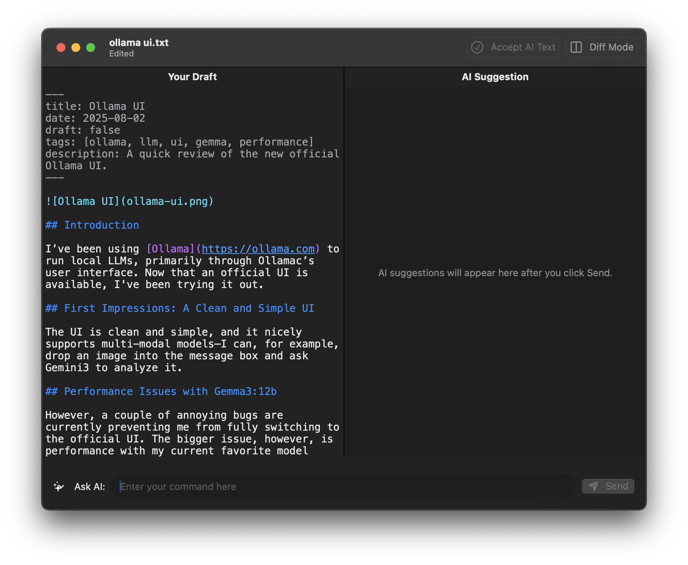

# VibeEdit

VibeEdit is an AI-assisted text editor for macOS, designed to streamline your writing and editing workflow. It features a dual-pane interface for easy comparison and modification of text, integrated AI capabilities, and essential file management options.



## Features

*   **AI-Assisted Editing**: Send text from the left pane to a local Ollama instance with a custom prompt for AI-driven modifications.
*   **Dual-Pane Interface**: Work with your original text in the left pane and see AI-generated or modified text in the right pane.
*   **Live Diff View**: Toggle a diff mode to visualize changes between the left and right panes, similar to Git diff, with additions in green and deletions in red.
*   **Configurable Settings**: Customize Ollama model and server address.
*   **File Operations**:
    *   **New**: Clear both text panes to start a new document.
    *   **Open**: Load `.txt` or `.md` files into the left pane.
    *   **Save**: Save the current content of the left pane to the last opened/saved file.
    *   **Save As...**: Save the content of the left pane to a new file with a user-specified name and extension.
*   **Busy Indicator**: A visual indicator in the toolbar shows when the AI is processing a request.
*   **Prompt Management**: Save, edit, and delete frequently used AI prompts for quick access. Prompts can be selected from a menu next to the "Ask AI" field.
*   **Keyboard Shortcuts**: Standard macOS keyboard shortcuts for file operations.
*   **Markdown syntax highlighting**: Highlighting for most common Markdown syntax

## Dependencies

To run VibeEdit, you will need:

*   **Ollama**: A local installation of [Ollama](https://ollama.ai/) is required to power the AI-assisted editing features.
*   **Ollama Models**: You will need to download and run a compatible model, such as `gemma3:12b`, using the Ollama CLI (e.g., `ollama run gemma3:12b`).

## Building from Source

To build VibeEdit from source, follow these steps:

1.  **Prerequisites**:
    *   Xcode (version 14.0 or later) with Command Line Tools installed.
    *   Git.

2.  **Clone the repository**:
    ```bash
    git clone https://github.com/veskuh/vibe-edit.git
    cd VibeEdit
    ```

3.  **Build the application**:
    ```bash
    xcodebuild build -scheme VibeEdit -destination 'platform=macOS' CODE_SIGN_IDENTITY="" CODE_SIGNING_REQUIRED=NO BUILD_DIR="$(PWD)/build"
    ```
    This command will build the application and place the `.app` bundle in a `build/Debug` directory within your project's root.

4.  **Run the application**:
    ```bash
    open ./build/Debug/VibeEdit.app
    ```
    You may need to grant permissions the first time you run it.

## Supported Platforms

VibeEdit is currently developed and tested for **macOS (ARM architecture only)**.

## License

VibeEdit is released under the BSD 3-Clause License. See the `LICENSE` file for more details.